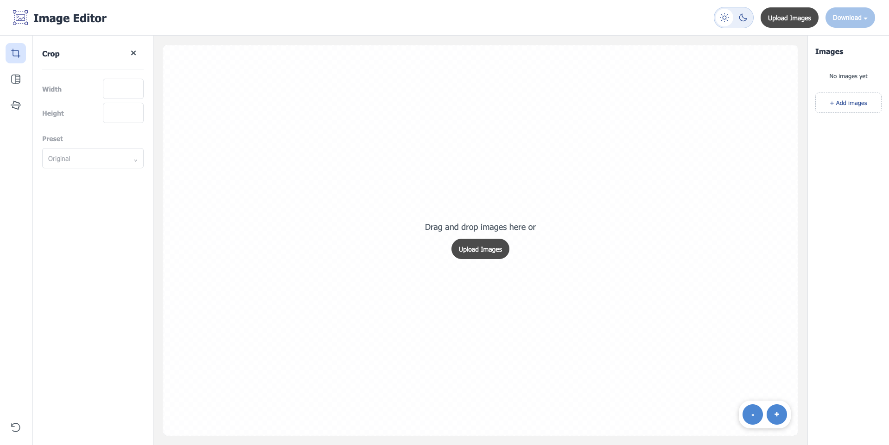
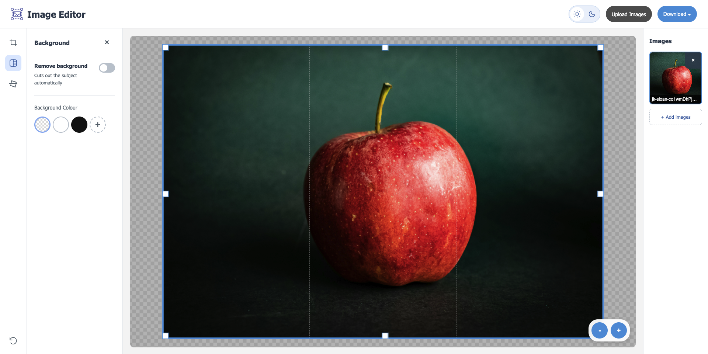
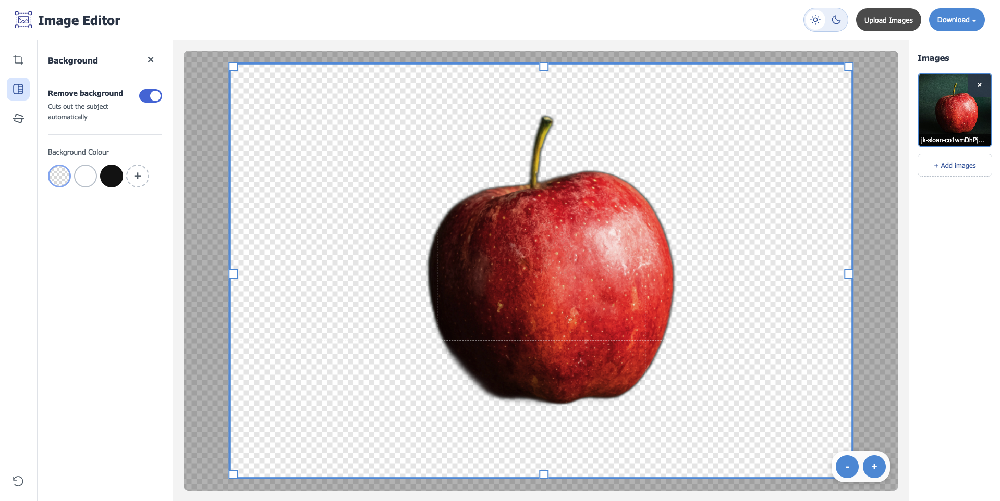
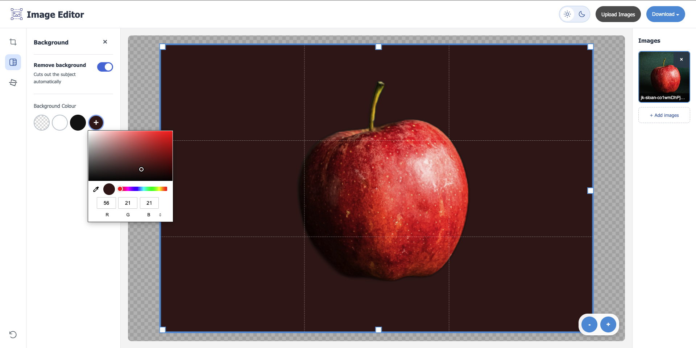
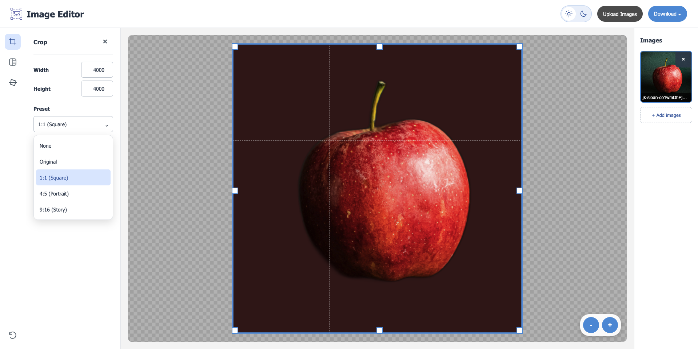
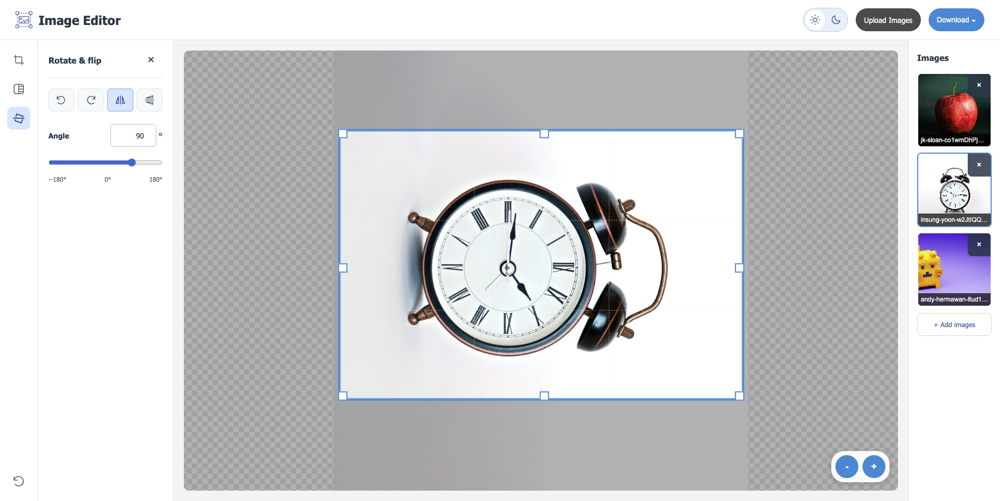
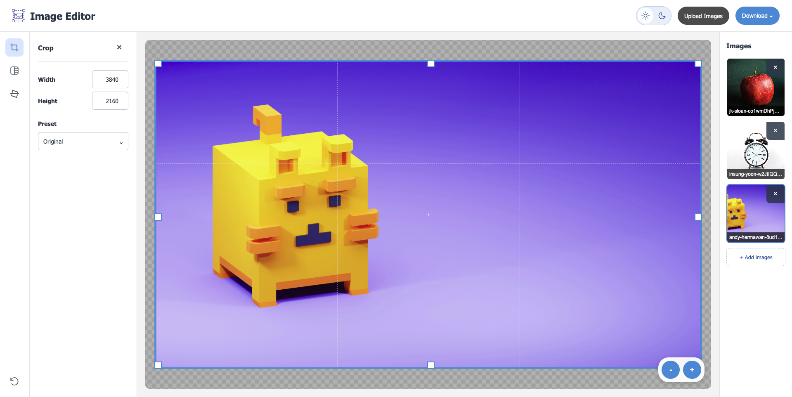
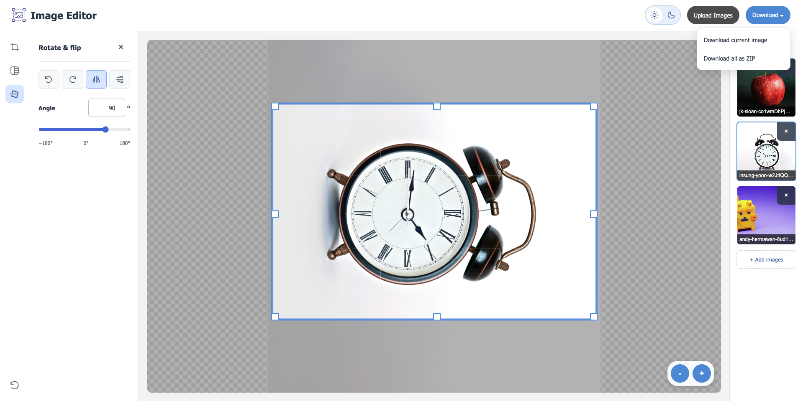
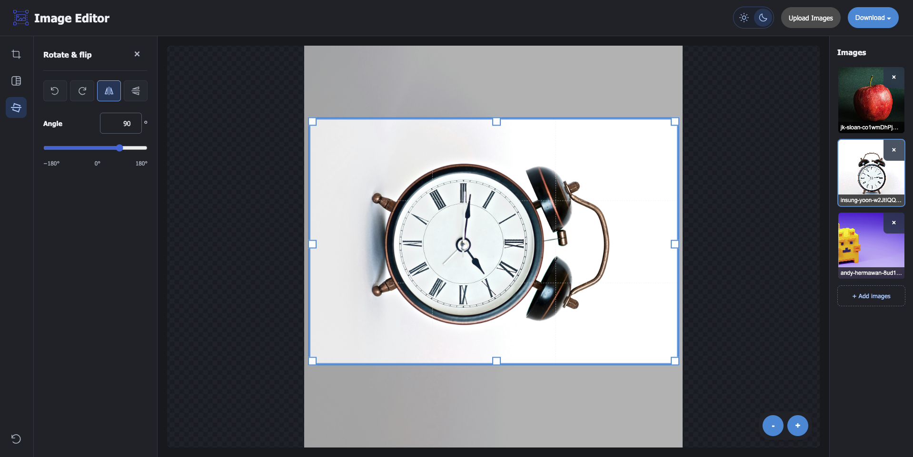

# Image Editor Web App

A simple web-based image editor for removing backgrounds and making quick edits, all in your browser. Built with Flask and Python.

## Try it out!

You can use the app directly here:
[https://shannenlolol.pythonanywhere.com/](https://shannenlolol.pythonanywhere.com/)

## Features

- **Remove backgrounds** from your images with one click
- **Replace the background** with transparent, white, black, or any colour you pick
- **Crop** freely or use aspect ratio presets
- **Resize** by setting exact width and height
- **Rotate and flip** images, including fine-tune angle adjustment
- **Upload multiple images** and switch between them easily
- **Remembers your edits** for each image when you switch between them
- **Download** the current image as a PNG, or all images together as a ZIP
- **Light and dark mode** that works on desktop and mobile

## How it works

### Main Interface


### Remove Background



### Change Background


### Resize and Aspect Ratio


### Rotate and Flip


### Multiple Images


### Download


### Dark Mode


## Run it locally (optional)

1. Clone the repository:
```bash
git clone https://github.com/yourusername/ImageEditorWebApp.git
cd ImageEditorWebApp
```

2. Create a virtual environment (recommended):
```bash
python -m venv venv
source venv/bin/activate  # On Windows, use: venv\Scripts\activate
```

3. Install the required packages:
```bash
pip install -r requirements.txt
```

4. Start the app:
```bash
python app.py
```

5. Open your browser and go to:
```
http://localhost:5000
```

## Built with

Python, Flask, rembg, Pillow, and HTML/CSS/JavaScript.

## Photo credits

The example images in the screenshots are from [Unsplash](https://unsplash.com):

- Photo by Insung Yoon on Unsplash
- Photo by Andy Hermawan on Unsplash
- Photo by JK Sloan on Unsplash